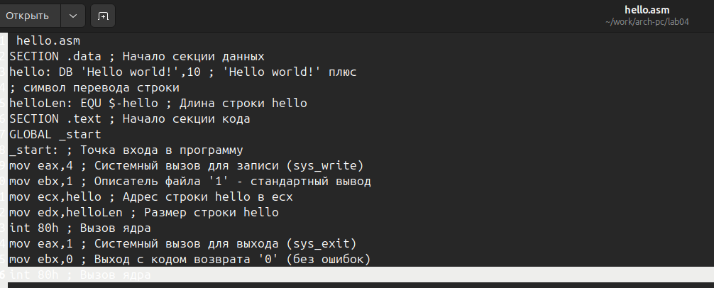
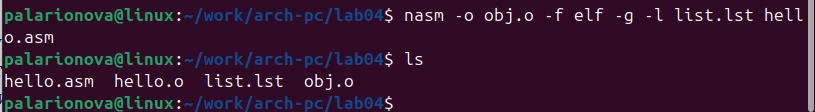
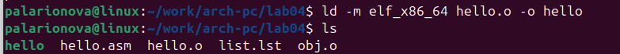
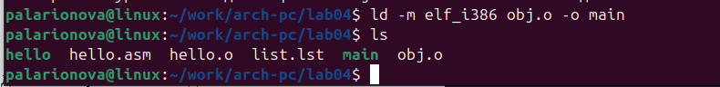
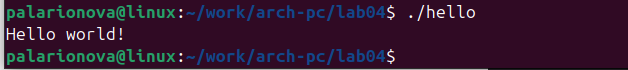
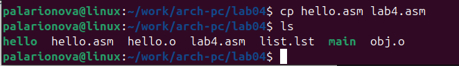
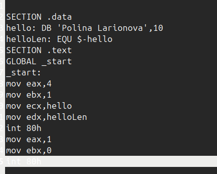
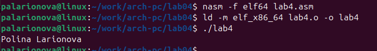
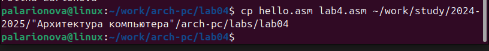
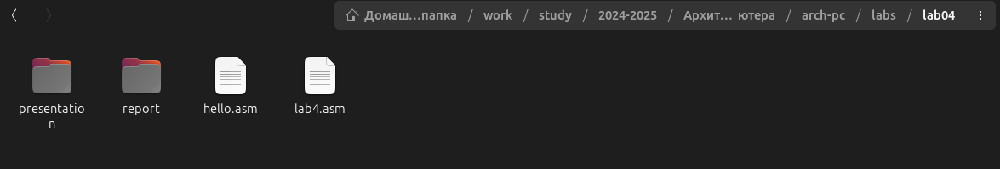

---
## Front matter
title: "Отчет по лабораторной работе №4"
subtitle: "Создание и процесс обработки программ на языке ассемблера NASM"
author: "Полина Алексеевна Ларионова"

## Generic otions
lang: ru-RU
toc-title: "Содержание"

## Bibliography
bibliography: bib/cite.bib
csl: pandoc/csl/gost-r-7-0-5-2008-numeric.csl

## Pdf output format
toc: true # Table of contents
toc-depth: 2
lof: true # List of figures
fontsize: 12pt
linestretch: 1.5
papersize: a4
documentclass: scrreprt
## I18n polyglossia
polyglossia-lang:
  name: russian
  options:
	- spelling=modern
	- babelshorthands=true
polyglossia-otherlangs:
  name: english
## I18n babel
babel-lang: russian
babel-otherlangs: english
## Fonts
mainfont: IBM Plex Serif
romanfont: IBM Plex Serif
sansfont: IBM Plex Sans
monofont: IBM Plex Mono
mathfont: STIX Two Math
mainfontoptions: Ligatures=Common,Ligatures=TeX,Scale=0.94
romanfontoptions: Ligatures=Common,Ligatures=TeX,Scale=0.94
sansfontoptions: Ligatures=Common,Ligatures=TeX,Scale=MatchLowercase,Scale=0.94
monofontoptions: Scale=MatchLowercase,Scale=0.94,FakeStretch=0.9
mathfontoptions:
## Biblatex
biblatex: true
biblio-style: "gost-numeric"
biblatexoptions:
  - parentracker=true
  - backend=biber
  - hyperref=auto
  - language=auto
  - autolang=other*
  - citestyle=gost-numeric
## Pandoc-crossref LaTeX customization
figureTitle: "Рис."
listingTitle: "Листинг"
lofTitle: "Список иллюстраций"
lolTitle: "Листинги"
## Misc options
indent: true
header-includes:
  - \usepackage{indentfirst}
  - \usepackage{float} # keep figures where there are in the text
  - \floatplacement{figure}{H} # keep figures where there are in the text
---

# Цель работы

Освоение процедуры компиляции и сборки программ, написанных на ассемблере NASM.

                           

# Выполнение лабораторной работы

Я перешла в созданный каталог,создала текстовый файл hello.asm и ввела в него заданный текст.

{#fig:001 width=70%}

Для компиляции текста я ввела заданную команду и проверила созданный файл, который имеет имя hello.o.

{#fig:002 width=70%}

Затем я скомпилировала исходный файл hello.asm в obj.o и проверила созданные файлы.

{#fig:003 width=70%}

Далее я передала объектный файл на обработку компоновщику и проверила наличие исполняемого файла.

{#fig:004 width=70%}

Я передала на обработку файл obj.o и проверила наличие исполняемого файла.

{#fig:005 width=70%}

Затем я запустила исполняемый файл hello.

{#fig:006 width=70%}

# Задания для самостоятельной работы 

С помощью команды cp я скопировала файл hello.asm d afqk с именем lab4.asm

{#fig:007 width=70%}

и ввела в созданный файл изменения.

{#fig:008 width=70%}

Затем я оттранслировала текст программы, провела компоновку и запустила исполняемый файл.

{#fig:009 width=70%}

Я скопировала файлы hello.asm и lab4.asm в каталог и проверила их наличие.

{#fig:010 width=70%}

{#fig:011 width=70%}

# Выводы

Я освоила процедуры компиляции и сборки программ, написанных на ассемблере.

