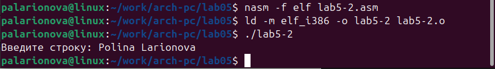

---
## Front matter
title: "Отчёт по лабораторной работа №5"
subtitle: "*дисциплина: Архитектура компьютера*"
author: "Полина Алексеевна Ларионова"

## Generic otions
lang: ru-RU
toc-title: "Содержание"

## Bibliography
bibliography: bib/cite.bib
csl: pandoc/csl/gost-r-7-0-5-2008-numeric.csl

## Pdf output format
toc: true # Table of contents
toc-depth: 2
lof: true # List of figures
lot: true # List of tables
fontsize: 12pt
linestretch: 1.5
papersize: a4
documentclass: scrreprt
## I18n polyglossia
polyglossia-lang:
  name: russian
  options:
	- spelling=modern
	- babelshorthands=true
polyglossia-otherlangs:
  name: english
## I18n babel
babel-lang: russian
babel-otherlangs: english
## Fonts
mainfont: IBM Plex Serif
romanfont: IBM Plex Serif
sansfont: IBM Plex Sans
monofont: IBM Plex Mono
mathfont: STIX Two Math
mainfontoptions: Ligatures=Common,Ligatures=TeX,Scale=0.94
romanfontoptions: Ligatures=Common,Ligatures=TeX,Scale=0.94
sansfontoptions: Ligatures=Common,Ligatures=TeX,Scale=MatchLowercase,Scale=0.94
monofontoptions: Scale=MatchLowercase,Scale=0.94,FakeStretch=0.9
mathfontoptions:
## Biblatex
biblatex: true
biblio-style: "gost-numeric"
biblatexoptions:
  - parentracker=true
  - backend=biber
  - hyperref=auto
  - language=auto
  - autolang=other*
  - citestyle=gost-numeric
## Pandoc-crossref LaTeX customization
figureTitle: "Рис."
tableTitle: "Таблица"
listingTitle: "Листинг"
lofTitle: "Список иллюстраций"
lolTitle: "Листинги"
## Misc options
indent: true
header-includes:
  - \usepackage{indentfirst}
  - \usepackage{float} # keep figures where there are in the text
  - \floatplacement{figure}{H} # keep figures where there are in the text
---

# Цель работы

Приобретение практических навыков работы в Midnight Commander. Освоение инструкций
языка ассемблера mov и int.

# Задание

Используя программу Midnight Commander, вывести сообщение на экран, предварительно введя строку с клавиатуры.

# Выполнение лабораторной работы

Открыв Midnight Commander, я перешла в каталог, созданный при выполнении лабораторной работы №4 и создала папку lab05.

{#fig:001 width=70%}

Перейдя в созданный каталог и пользуясь строкой ввода и командой touch, я создала файл lab5-1.asm.

{#fig:002 width=70%}

С помощью редактора nano был открыт файл lab5-1.asm, и я ввела текст программы из листинга 5.1. 

{#fig:003 width=70%}

Далее я убедилась, что файл содержит текст программы, открыв его для просмотра. 

{#fig:004 width=70%}

Потом я оттранслировала текст программы в объектный файл и, выполнив компоновку, запустила исполняемый файл. 

{#fig:005 width=70%}

Я скачала файл in_out.asm со страницы курса ТУИС и скопировала данный файл в каталог с файлом lab5-1.asm.

{#fig:006 width=70%}

Дальше я создала копию файла lab5-1.asm с именем lab5-2.asm 

{#fig:007 width=70%}

и исправила текст программы в соответствии с листингом 5.2, после чего создала исполняемый файл и проверила его работу. 

{#fig:008 width=70%}

{#fig:009 width=70%}

В файле lab5-2.asm я заменила подпрограмму sprintLF на sprint. 

{#fig:010 width=70%}

Разница в данных подпрограммах состоит в том, что введенная строка отображается по-разному.

# Задания для самостоятельной работы 

Создав копию файла lab5-1.asm, я внесла изменения, указанные в задании, в текст программы.

{#fig:011 width=70%}

Далее я создала исполняемый файл и запустила его.

{#fig:012 width=70%}

Создав копию файла lab5-2.asm (с подключением внешнего файла), я вновь внеса изменения в текст программы, после чего создала еще один исполняемый файл и запустила его.

{#fig:013 width=70%}

{#fig:014 width=70%}

# Выводы

Во время выполнения данной лабораторной работы я научилась работать с программой Midnight Commander, подключать внешние файлы, а также наблюдать за изменениями вывода строки на экран после изменения различных подпрограмм.

