---
## Front matter
title: "Отчет по лабораторной работе №6"
subtitle: "*Арифметические операции в NASM*"
author: "Полина Алексеевна Ларионова"

## Generic otions
lang: ru-RU
toc-title: "Содержание"

## Bibliography
bibliography: bib/cite.bib
csl: pandoc/csl/gost-r-7-0-5-2008-numeric.csl

## Pdf output format
toc: true # Table of contents
toc-depth: 2
lof: true # List of figures
fontsize: 12pt
linestretch: 1.5
papersize: a4
documentclass: scrreprt
## I18n polyglossia
polyglossia-lang:
  name: russian
  options:
	- spelling=modern
	- babelshorthands=true
polyglossia-otherlangs:
  name: english
## I18n babel
babel-lang: russian
babel-otherlangs: english
## Fonts
mainfont: IBM Plex Serif
romanfont: IBM Plex Serif
sansfont: IBM Plex Sans
monofont: IBM Plex Mono
mathfont: STIX Two Math
mainfontoptions: Ligatures=Common,Ligatures=TeX,Scale=0.94
romanfontoptions: Ligatures=Common,Ligatures=TeX,Scale=0.94
sansfontoptions: Ligatures=Common,Ligatures=TeX,Scale=MatchLowercase,Scale=0.94
monofontoptions: Scale=MatchLowercase,Scale=0.94,FakeStretch=0.9
mathfontoptions:
## Biblatex
biblatex: true
biblio-style: "gost-numeric"
biblatexoptions:
  - parentracker=true
  - backend=biber
  - hyperref=auto
  - language=auto
  - autolang=other*
  - citestyle=gost-numeric
## Pandoc-crossref LaTeX customization
figureTitle: "Рис."
listingTitle: "Листинг"
lofTitle: "Список иллюстраций"
lolTitle: "Листинги"
## Misc options
indent: true
header-includes:
  - \usepackage{indentfirst}
  - \usepackage{float} # keep figures where there are in the text
  - \floatplacement{figure}{H} # keep figures where there are in the text
---

# Цель работы

Освоение арифметических инструкций языка ассемблера NASM.

# Задание

Ознакомиться с основными арифметическими операциями на языке Ассемблера, символьными и численными данными. Выполнить арифметические операции и вариант вычисления задания по номеру студенческого билета. 

# Выполнение лабораторной работы

Я создала каталог для программ лабораторной работы №6, создала файл lab6-1.asm и открыла его.

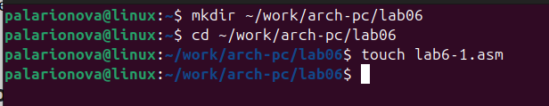{#fig:001 width=70%}

В соответствии с листингом 6.1 я ввела в файл текст программы.

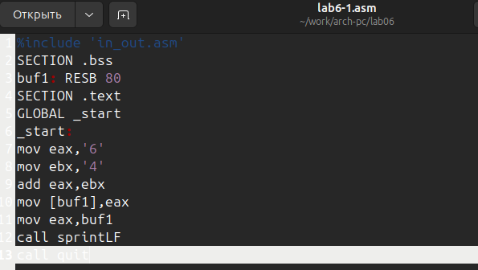{#fig:002 width=70%}

Далее я создала исполняемый файл и запустила его.

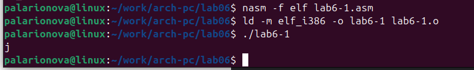{#fig:003 width=70%}

Затем я изменила текст программы, записав регистры числа вместо символов.

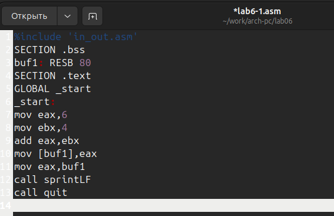{#fig:004 width=70%}

И так же создала исполняемый файл, в котором символ не был отображен при выводе на экран.

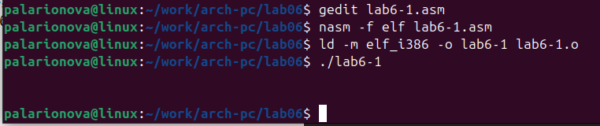{#fig:005 width=70%}

Далее я создала файл lab6-2.asm и ввела в него текст программы из листинга 6.2

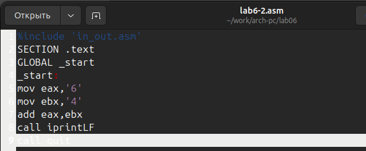{#fig:006 width=70%}

И создала исполняемый файл и запустила его.

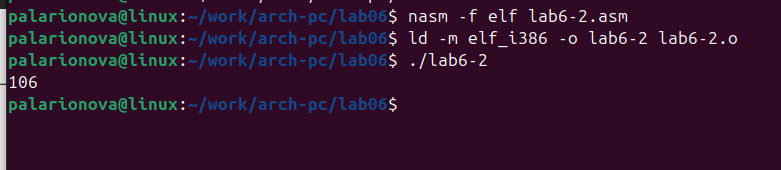{#fig:007 width=70%}

Аналогично предыдущему примеру я изменила символы на числа и запустила исполняемый файл.

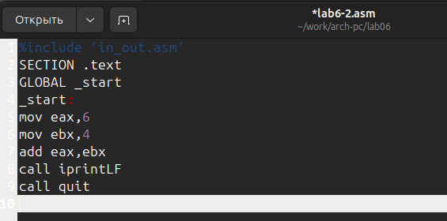{#fig:008 width=70%}

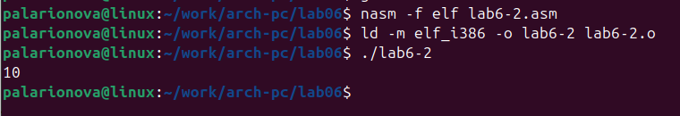{#fig:009 width=70%}

Затем я заменила функцию iprintLF на iprint и запустила исполняемый файл. Различие выводов функций заключается в отображении числа на разных строках.

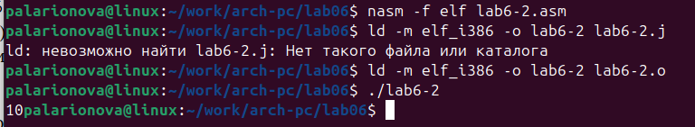{#fig:010 width=70%}

Создав файл lab6-3.asm, я ввела в файл текст программы из листинга 6.3

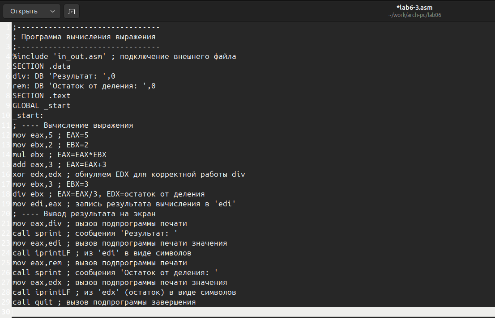{#fig:011 width=70%}

и проверила работу программы, создав исполняемый файл.

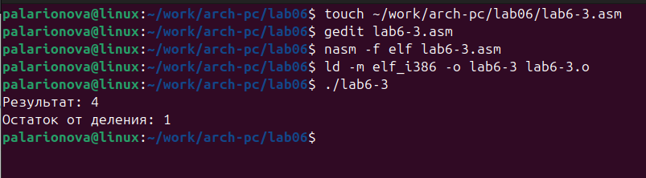{#fig:012 width=70%}

Затем я изменила текст программы для вычисления другого выражения и проверила работу.

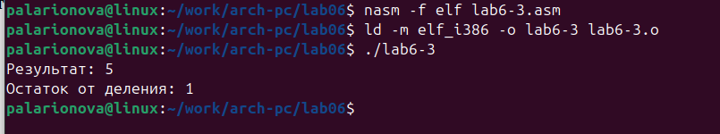{#fig:013 width=70%}

Далее я создала файл variant.asm и ввела в него текст программы из листинга 6.4 

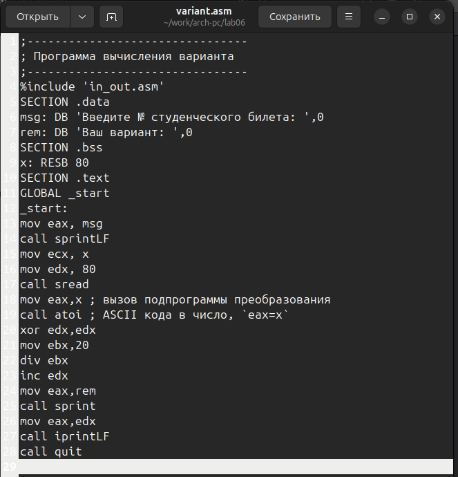{#fig:014 width=70%}

и проверила работу программы, узнав свой вариант для выполнения самостоятельной работы.

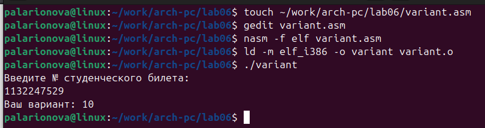{#fig:015 width=70%}
 
 
# Ответы на вопросы

1) Какие строки листинга 6.4 отвечают за вывод на экран сообщения ‘Ваш вариант:’?
mov eax,msg call sprintLF

2) Для чего используется следующие инструкции? mov ecx, x mov edx, 80 call sread

Они используются для ввода переменной Х с клавиатуры и сохранения введенных данных.

3) Для чего используется инструкция “call atoi”?

Для преобразования кода переменной ASCII в число.

4) Какие строки листинга 6.4 отвечают за вычисления варианта?

mov ebx,20 div ebx inc edx

5) В какой регистр записывается остаток от деления при выполнении инструкции “div ebx”?
 
В регистр ebx.

6) Для чего используется инструкция “inc edx”?

Для увеличения edx на 1.

7) Какие строки листинга 6.4 отвечают за вывод на экран результата вычислений?

mov eax, edx call iprintLF 

# Задание для самостоятельной работы 

Получив свой вариант, я написала программу для вычисления выражения из варианта 10, но при запуске исполняемого файла получала неверные ответы для х1 и х2.

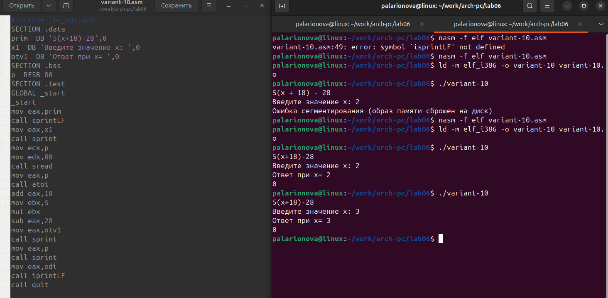{#fig:016 width=70%}

# Выводы

Я освоила арифметические операции на языке Ассемблера.

