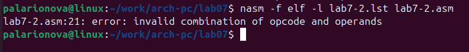

---
## Front matter
title: "Лабораторная работа №7"
subtitle: "Команды безусловного и условного перехода в Nasm. Программирование ветвлений."
author: "Полина Алексеевна Ларионова"

## Generic otions
lang: ru-RU
toc-title: "Содержание"

## Bibliography
bibliography: bib/cite.bib
csl: pandoc/csl/gost-r-7-0-5-2008-numeric.csl

## Pdf output format
toc: true # Table of contents
toc-depth: 2
fontsize: 12pt
linestretch: 1.5
papersize: a4
documentclass: scrreprt
## I18n polyglossia
polyglossia-lang:
  name: russian
  options:
	- spelling=modern
	- babelshorthands=true
polyglossia-otherlangs:
  name: english
## I18n babel
babel-lang: russian
babel-otherlangs: english
## Fonts
mainfont: IBM Plex Serif
romanfont: IBM Plex Serif
sansfont: IBM Plex Sans
monofont: IBM Plex Mono
mathfont: STIX Two Math
mainfontoptions: Ligatures=Common,Ligatures=TeX,Scale=0.94
romanfontoptions: Ligatures=Common,Ligatures=TeX,Scale=0.94
sansfontoptions: Ligatures=Common,Ligatures=TeX,Scale=MatchLowercase,Scale=0.94
monofontoptions: Scale=MatchLowercase,Scale=0.94,FakeStretch=0.9
mathfontoptions:
## Biblatex
biblatex: true
biblio-style: "gost-numeric"
biblatexoptions:
  - parentracker=true
  - backend=biber
  - hyperref=auto
  - language=auto
  - autolang=other*
  - citestyle=gost-numeric
## Pandoc-crossref LaTeX customization
figureTitle: "Рис."
listingTitle: "Листинг"
lofTitle: "Список иллюстраций"
lolTitle: "Листинги"
## Misc options
indent: true
header-includes:
  - \usepackage{indentfirst}
  - \usepackage{float} # keep figures where there are in the text
  - \floatplacement{figure}{H} # keep figures where there are in the text
---

# Цель работы

Изучение команд условного и безусловного переходов. Приобретение навыков написания
программ с использованием переходов. Знакомство с назначением и структурой файла
листинга.
 
# Выполнение лабораторной работы

Я создала каталог для программ лабораторной работы №7 и файл lab7-1.asm.

{#fig:001 width=70%}

Далее я ввела в файл текст программы из листинга 7.1

{#fig:002 width=70%}

и проверила его работу, создав исполняемый файл.

{#fig:003 width=70%}

Дальше я изменила текст программы в соответствии с листингом 7.2

{#fig:004 width=70%}

и создала исполняемый файл.

{#fig:005 width=70%}

Затем я изменила текст программы еще раз, чтобы получить результат, указанный в лабораторной работе и снова создала исполняемый файл.

{#fig:006 width=70%}

После этого я создала файл lab7-2.asm и ввела в него текст программы из листинга 7.3

{#fig:007 width=70%}

и создала исполняемый файл, проверив его работу, введя различные значения В.

{#fig:008 width=70%}

Я создала файл листинга для программы из файла lab7-2.asm и изучила его структуру, открыв в редакторе mcedit.

{#fig:009 width=70%}

Проанализировав файл, я поняла, какие значения он выводит и как работает.

Первая строка находится на 49 месте. Адрес этой строки "00000168", а машинный код - E86EFFFFFF. Call quit оканчивает работу программы и выходит из нее.

{#fig:010 width=70%}

Вторая строка находится на 17 месте, ее адрес "000000F2", машинный код - B9 [0A000000], а mov ecx,B - это исходный текст программы, который означает введение переменной B.

{#fig:011 width=70%}

Третья строка находится на 35 месте. Её адрес "00000130", машинный код - E867FFFFFF, call atoi - исходный текст программы, который означает перевод символа в лежащей выше строке в число.

{#fig:012 width=70%}

Открыв файл с программой lab7-2.asm, я удалила один из операндов в инструкции, но выходные файлы не создались, так как для работы программы требуется два операнда.

{#fig:013 width=70%}

# Задания для самостоятельной работы 

1) Я написала программу нахождения наименьшей из 3 целочисленных переменных в соответствии с полученным 10 вариантом.

{#fig:014 width=70%}

Затем я создала исполняемый файл и ввела числа, указанные в варианте 10.

{#fig:015 width=70%}

2) Я написала программу, которая для введенных с клавиатуры значений *x* и *a* вычисляет значение заданной функции f(x) в соответствии с заданием варианта 10.

{#fig:016 width=70%}

Далее я создала исполняемый файл и ввела значения для *х* и *а*, указанные в варианте 10.

{#fig:017 width=70%}

# Выводы

При выполнении лабораторной работы №7 я изучила команды условного и безусловного перехода, а также научилась писать программы с переходами.

