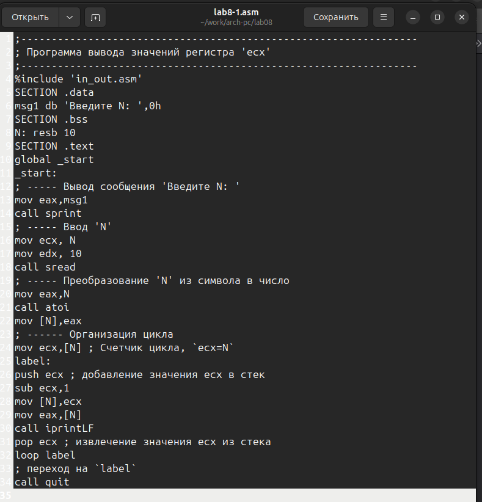
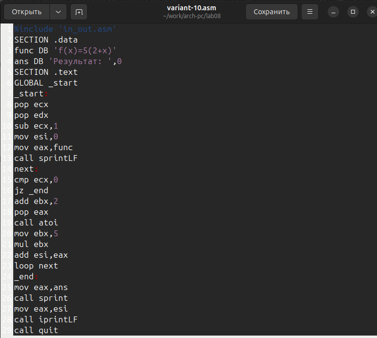

---
## Front matter
title: "Отчет по лабораторной работе №8"
subtitle: "Программирование цикла. Обработка аргументов командной строки."
author: "Полина Алексеевна Ларионова"

## Generic otions
lang: ru-RU
toc-title: "Содержание"

## Bibliography
bibliography: bib/cite.bib
csl: pandoc/csl/gost-r-7-0-5-2008-numeric.csl

## Pdf output format
toc: true # Table of contents
toc-depth: 2
lof: true # List of figures
fontsize: 12pt
linestretch: 1.5
papersize: a4
documentclass: scrreprt
## I18n polyglossia
polyglossia-lang:
  name: russian
  options:
	- spelling=modern
	- babelshorthands=true
polyglossia-otherlangs:
  name: english
## I18n babel
babel-lang: russian
babel-otherlangs: english
## Fonts
mainfont: IBM Plex Serif
romanfont: IBM Plex Serif
sansfont: IBM Plex Sans
monofont: IBM Plex Mono
mathfont: STIX Two Math
mainfontoptions: Ligatures=Common,Ligatures=TeX,Scale=0.94
romanfontoptions: Ligatures=Common,Ligatures=TeX,Scale=0.94
sansfontoptions: Ligatures=Common,Ligatures=TeX,Scale=MatchLowercase,Scale=0.94
monofontoptions: Scale=MatchLowercase,Scale=0.94,FakeStretch=0.9
mathfontoptions:
## Biblatex
biblatex: true
biblio-style: "gost-numeric"
biblatexoptions:
  - parentracker=true
  - backend=biber
  - hyperref=auto
  - language=auto
  - autolang=other*
  - citestyle=gost-numeric
## Pandoc-crossref LaTeX customization
figureTitle: "Рис."
listingTitle: "Листинг"
lofTitle: "Список иллюстраций"
lolTitle: "Листинги"
## Misc options
indent: true
header-includes:
  - \usepackage{indentfirst}
  - \usepackage{float} # keep figures where there are in the text
  - \floatplacement{figure}{H} # keep figures where there are in the text
---

# Цель работы

Приобретение навыков написания программ с использованием  циков и обработкой аргументов командной строки.

# Выполнение лабораторной работы

Я создала каталог с файлом для выполнения лабораторной работа №8.

{#fig:001 width=70%}

Я внесла в файл текст программы из листинга 8.1ю

{#fig:002 width=70%}

Далее я создала исполняемый файл, чтобы проверить работу программы.

{#fig:003 width=70%}

Затем я внесла изменения в программу и создала исполняемый файл.

{#fig:004 width=70%}

{#fig:005 width=70%}

Я снова изменила текст программы и создала исполняемый файл.

{#fig:006 width=70%}

{#fig:007 width=70%}

Я создала файл lab8-2.asm и внесла в него текст из листинга 8.2.

{#fig:008 width=70%}

Проверила его работу, задав аргументы.

{#fig:009 width=70%}

Далее я создала файл lab8-3.asm и ввела в него текст программы из листинга 8.3.

{#fig:010 width=70%}

Я проверила его работу, указав аргументы.

{#fig:011 width=70%}

Для вычисления произведения аргументов я изменила текст программы.

{#fig:012 width=70%}

Затем проверила его работу.

{#fig:013 width=70%}

# Задания для самостоятельной работы

Я написала текст программы, которая находит сумму значений функции в соответствии с 10 вариантом.

{#fig:014 width=70%}

Далее я создала исполняемый файл и ввела несколько аргументов.

{#fig:015 width=70%}

# Выводы

Я научилась  программировать цикл и обрабатывать аргументы командной строки при выполнении данной лабораторной работы.

