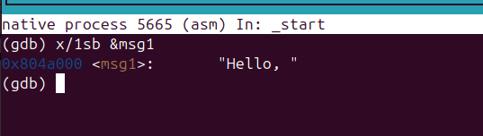
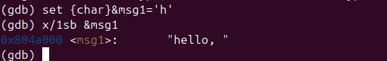
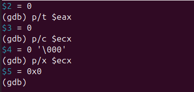
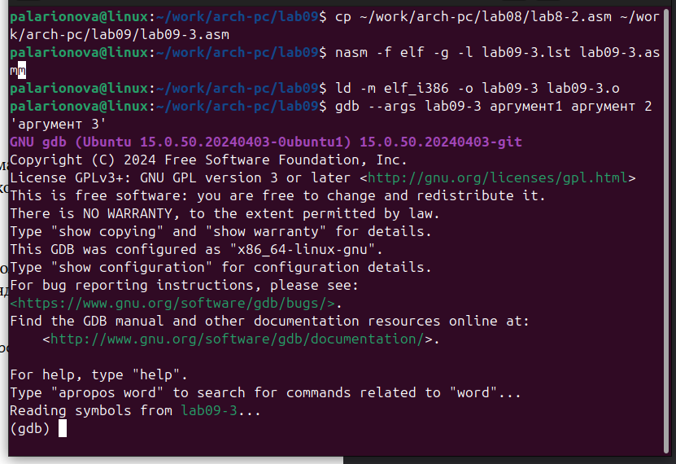

---
## Front matter
title: "Отчет по лабораторной работе №9"
subtitle: "Понятие подпрограммы. Отладчик GDB."
author: "Полина Алексеевна Ларионова"

## Generic otions
lang: ru-RU
toc-title: "Содержание"

## Bibliography
bibliography: bib/cite.bib
csl: pandoc/csl/gost-r-7-0-5-2008-numeric.csl

## Pdf output format
toc: true # Table of contents
toc-depth: 2
lof: true # List of figures
fontsize: 12pt
linestretch: 1.5
papersize: a4
documentclass: scrreprt
## I18n polyglossia
polyglossia-lang:
  name: russian
  options:
	- spelling=modern
	- babelshorthands=true
polyglossia-otherlangs:
  name: english
## I18n babel
babel-lang: russian
babel-otherlangs: english
## Fonts
mainfont: IBM Plex Serif
romanfont: IBM Plex Serif
sansfont: IBM Plex Sans
monofont: IBM Plex Mono
mathfont: STIX Two Math
mainfontoptions: Ligatures=Common,Ligatures=TeX,Scale=0.94
romanfontoptions: Ligatures=Common,Ligatures=TeX,Scale=0.94
sansfontoptions: Ligatures=Common,Ligatures=TeX,Scale=MatchLowercase,Scale=0.94
monofontoptions: Scale=MatchLowercase,Scale=0.94,FakeStretch=0.9
mathfontoptions:
## Biblatex
biblatex: true
biblio-style: "gost-numeric"
biblatexoptions:
  - parentracker=true
  - backend=biber
  - hyperref=auto
  - language=auto
  - autolang=other*
  - citestyle=gost-numeric
## Pandoc-crossref LaTeX customization
figureTitle: "Рис."
listingTitle: "Листинг"
lofTitle: "Список иллюстраций"
lolTitle: "Листинги"
## Misc options
indent: true
header-includes:
  - \usepackage{indentfirst}
  - \usepackage{float} # keep figures where there are in the text
  - \floatplacement{figure}{H} # keep figures where there are in the text
---

# Цель работы

Приобретение навыков написания программ с использованием подпрограмм. Знакомство с методами откладки при помощи GDB и его основными возможностями.

# Выполнение лабораторной работы

Я создала каталог для выполнения лабораторной работы и создала файл lab09-1.asm.

{#fig:001 width=70%}

Затем я ввела в файл текст программы из листинга 9.1

{#fig:002 width=70%}

и создала исполняемый файл.

{#fig:003 width=70%}

Я изменила текст программы, добавив подпрограмму subcalcul_

{#fig:004 width=70%}

и проверила его работу.

{#fig:005 width=70%}

Я создала файл lab09-2.asm с текстом программы из листинга 9.2.

{#fig:006 width=70%}

Далее я добавила в исполняемый файл отладочную информацию и загрузила исполняемый файл в отладчик gdb, проверив работу программы.

{#fig:007 width=70%}

Для более подробного анализа программы я установила брейкпоинт на метку _start.

{#fig:008 width=70%}

Затем я посмотрела дисассимилированный код программы

{#fig:009 width=70%}

и переключилась на отображение команд с синтаксисом Intel.

{#fig:010 width=70%}

Отличие заключается в программах: в дисассимилированном отображении в командах используются % и $, когда в Intel отображении они не используются.

Я включила режим псевдографики.

{#fig:011 width=70%}

Я установила точку останова по адресу инструкции.

{#fig:012 width=70%}

Далее я посмотрела информацию о всех установленных точках останова.

{#fig:013 width=70%}

Я посмотрела содержимое регистров.

{#fig:014 width=70%}

Также я посмотрела значение переменной msg1 по имени

{#fig:015 width=70%}

и значение переменной msg2 по адресу.

{#fig:016 width=70%}

Далее я изменила первый символ переменной msg1

{#fig:017 width=70%}

и символы во второй переменной msg2.

{#fig:018 width=70%}

Я вывела значения регистра edx в различных форматах.

{#fig:019 width=70%}

С помощью команды set я изменила значение регистра ebx.

{#fig:020 width=70%}

Команда выводит разные значения, так как в первом вносится значение 2, а во втором регистр равен двум.

Я скопировала файл lab8-2.asm, создала исполняемый файл и загрузила его в отладчик, указав аргументы.

{#fig:021 width=70%}

Затем я установила точку останова перед первой инструкцией.

{#fig:022 width=70%}

Проверила адрес вершины стека и убедилась, что там хранится 5 элементов.

{#fig:023 width=70%}

Дальше я посмотрела остальные позиции стека.

{#fig:024 width=70%}

По первому адресу хранится адрес, в остальных - элементы. Элементы расположены с интервалом 4 единицы, поэтому компьютер использует новый стек, так как они хранят информацию до 4 байт.

# Задания для самостоятельной работы 

1) Я преобразовала программу из лабораторной работы №8 и реализовала вычисление как подпрограмму. Создала исполняемый файл и проверила его работу.

{#fig:025 width=70%}

2) Я создала файл lab09-5.asm и ввела в него программу из листинга 9.3

{#fig:026 width=70%}

Проверив его работу, я убедилась, что результат неверный.

{#fig:027 width=70%}

Я открыла программу в отладчике.

{#fig:028 width=70%}

Затем открыла регистры и поняла, что некоторые из них стоят не на своих местах.

{#fig:029 width=70%}

Исправив ошибку, программа выдала верный результат.

{#fig:030 width=70%}

# Выводы

При выполнении лабораторной работы я приобрела навыки написания программ использованием подпрограмм, а также познакомилась с методами отладки при помощи gbd и его основными возможностями.

