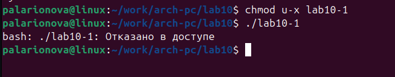

---
## Front matter
title: "Отчет по лабораторной работе №10"
subtitle: "Работа с файлами средствами NASM."
author: "Полина Алексеевна Ларионова"

## Generic otions
lang: ru-RU
toc-title: "Содержание"

## Bibliography
bibliography: bib/cite.bib
csl: pandoc/csl/gost-r-7-0-5-2008-numeric.csl

## Pdf output format
toc: true # Table of contents
toc-depth: 2
lof: true # List of figures
fontsize: 12pt
linestretch: 1.5
papersize: a4
documentclass: scrreprt
## I18n polyglossia
polyglossia-lang:
  name: russian
  options:
	- spelling=modern
	- babelshorthands=true
polyglossia-otherlangs:
  name: english
## I18n babel
babel-lang: russian
babel-otherlangs: english
## Fonts
mainfont: IBM Plex Serif
romanfont: IBM Plex Serif
sansfont: IBM Plex Sans
monofont: IBM Plex Mono
mathfont: STIX Two Math
mainfontoptions: Ligatures=Common,Ligatures=TeX,Scale=0.94
romanfontoptions: Ligatures=Common,Ligatures=TeX,Scale=0.94
sansfontoptions: Ligatures=Common,Ligatures=TeX,Scale=MatchLowercase,Scale=0.94
monofontoptions: Scale=MatchLowercase,Scale=0.94,FakeStretch=0.9
mathfontoptions:
## Biblatex
biblatex: true
biblio-style: "gost-numeric"
biblatexoptions:
  - parentracker=true
  - backend=biber
  - hyperref=auto
  - language=auto
  - autolang=other*
  - citestyle=gost-numeric
## Pandoc-crossref LaTeX customization
figureTitle: "Рис."
listingTitle: "Листинг"
lofTitle: "Список иллюстраций"
lolTitle: "Листинги"
## Misc options
indent: true
header-includes:
  - \usepackage{indentfirst}
  - \usepackage{float} # keep figures where there are in the text
  - \floatplacement{figure}{H} # keep figures where there are in the text
---

# Цель работы

Приобретение навыков написания программ для работы с файлами.

# Выполнение лабораторной работы

Я создала каталог для программ лабораторной работы №10 и необходимые файлы.

{#fig:001 width=70%}

Далее я ввела в файл lab10-1.asm текст программы из листинга 10.1

{#fig:002 width=70%}

и проверила его работу.

{#fig:003 width=70%}

С помощью команды chmod я изменила права доступа к исполняемому файлу и попыталась его выполнить.

{#fig:004 width=70%}

Выдало отказ в доступе, так как я запретила выполнение для владельца.

Далее с помощью этой же команды я добавила права на исполнение файла.

{#fig:005 width=70%}

Программа работает, так как файл был со всеми разрешениями, а до этого я запрещала исполнение готовой программы, поэтому данная программа обладает всеми разрешениями.

Я предоставила права файлу readme-1.txt в соответствии с вариантом 10 в символьном виде.

{#fig:006 width=70%}

Для файла readme-2.txt я предоставила права в двоичном виде в соответствии со своим вариантом.

{#fig:007 width=70%}

# Задание для самостоятельной работы

Я написала программу по заданному алгоритму.

{#fig:008 width=70%}

Затем я проверила его работу, наличие файла и его содержимого.

{#fig:009 width=70%}

# Вывод 

Я приобрела навыки написания программ для работы с файлами при выполнении лабораторной работы.
